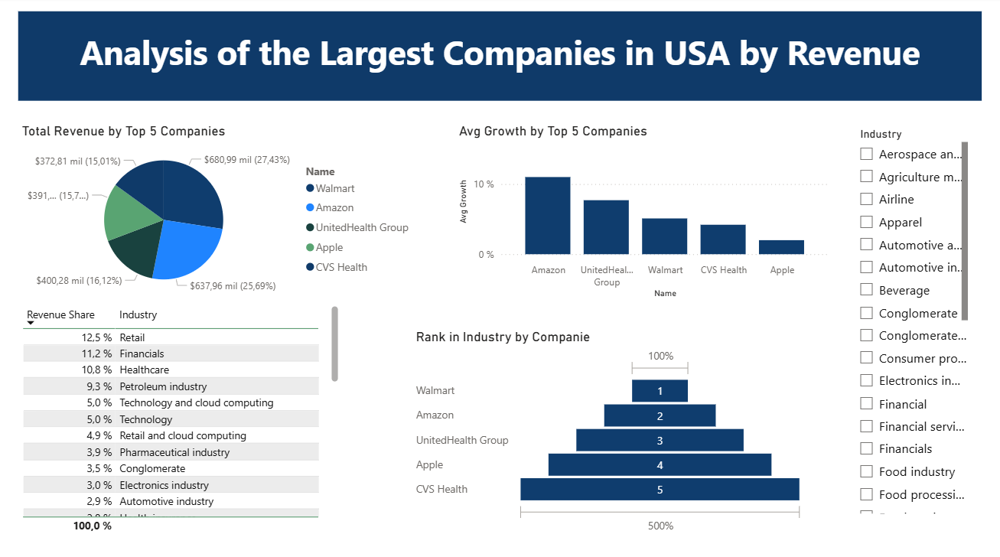

# Analysis of the Largest Companies in the USA by Revenue (2025)

**Description**  
This project explores the 100 largest U.S. companies by revenue (2025). It contains data cleaning (Python), cleaned CSVs, and a Power BI dashboard with visualizations such as top companies by revenue, industry revenue share, average revenue growth, and more.

**Contents**
- `data/` — cleaned CSV files used in analysis (companies.csv, optional summaries).
- `notebooks/` — Jupyter notebook `data_cleaning.ipynb` with web-scraping and cleaning steps.
- `powerbi/` — Power BI report `largest_companies_dashboard.pbix`.
- `scripts/` — optional Python scripts for automated cleaning.

**Key visuals**
- Top 5 companies by revenue (bar chart)
- Revenue share by industry (table / pie)
- Average revenue growth by industry (bar chart)
- Total revenue (summary card / pie)

---

## Setup & Execution

```bash
# Setup
# Clone the repository
git clone https://github.com/your-username/largest-companies-usa.git
cd largest-companies-usa

# Install dependencies
pip install -r requirements.txt
```

## Dashboard Preview
Here’s an overview of the Power BI dashboard included in the project:



```bash
- To open:
  - Option 1 (recommended): Download the repository as a ZIP from GitHub, extract it, and open the PBIX file in Power BI Desktop.
  - Option 2: Clone the repository using Git and open the PBIX file directly.
  - Do **not** click “Download Raw” on the PBIX file—this may corrupt the file.
```

**Highlights**
- Top 5 companies by revenue (Walmart, Amazon, Apple, etc.)
- Industry revenue share (Technology, Retail, Energy, etc.)
- Average revenue growth by industry
- Total revenue summary card

**Highlights**
- Top 5 companies by revenue (Walmart, Amazon, Apple, etc.)
- Industry revenue share (Technology, Retail, Energy, etc.)
- Average revenue growth by industry
- Total revenue summary card

## Data Source
Data obtained from Wikipedia – List of largest companies in the United States by revenue
.

## License
This project is for educational and analytical purposes only.
All data belongs to their original source (Wikipedia).

### Author
```bash
Vanessa Silva
Data Analyst | Exploring Data through Power BI and Python
